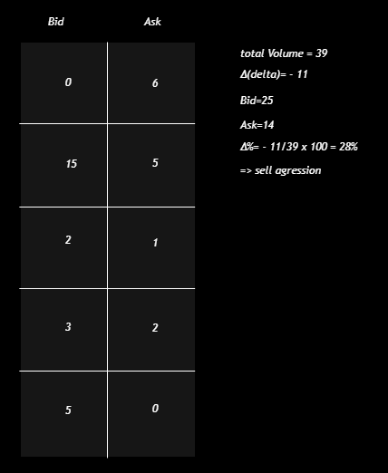

# Commulative Volume Delta (CVD)

## What is Delta?

<aside>

Delta represents the difference between the traded volume executed at the **ask price** and the traded volume executed at the **bid price** within a given time period.

</aside>

**Delta = Volume of Market Buys − Volume of Market Sells = Ask traded - Bid traded**

- **Aggressive buyers** → traders hitting the ask with market buy orders.
- **Aggressive sellers** → traders hitting the bid with market sell orders.
- If **Delta > 0** → more aggressive buying pressure.
- If **Delta < 0** → more aggressive selling pressure.

---

# Delta Metrics and Their Sections

---

When analyzing Delta in trading platforms, you will usually find it broken down into several numerical sections. These help traders evaluate not only the balance between buying and selling, but also the intensity and extremes of order flow.

The most common five sections are:

---

### 1. Total Volume

This represents the overall traded volume within the selected candle or time frame, regardless of whether trades were executed at the bid or ask.

### 2. **Delta Volume**

This is the net difference between aggressive buying volume (at the ask) and aggressive selling volume (at the bid).

- Negative Delta Volume → selling pressure dominated.
- Positive Delta Volume → buying pressure dominated.

### 3. **Delta Percent**

The percentage difference of Delta relative to the total traded volume.

### 4. **Delta Max**

This is the highest positive Delta recorded during the period.

### 5. **Delta Min**

This is the lowest negative Delta recorded during the period.

---

## What is Cumulative Volume Delta (CVD)?

---

While Delta shows the balance for a single bar or candle, **Cumulative Volume Delta (CVD)** accumulates Delta values over time, creating a continuous measure of buying and selling pressure.

- If CVD is rising → aggressive buying dominates over time.
- If CVD is falling → aggressive selling dominates over time.
- If price and CVD move together, it confirms that the trend is supported by real order flow.
- If price and CVD diverge, it raises questions about the sustainability of the move.

This makes CVD particularly useful for identifying **divergences** between price and underlying order flow.

---

## CVD Divergence

---

A **divergence** occurs when price and CVD do not confirm each other. Price might make new highs or lows, but CVD tells a different story about the underlying order flow. This mismatch is often one of the clearest early warnings that a trend is ending or that significant absorption is happening.

---

## Divergence Types

---

### Downtrend Exhaustion

---

- **Price behavior:** The market prints new lower lows.
- **CVD behavior:** Fails to make corresponding new lows.
- **Meaning:** Sellers are no longer aggressively pushing the market lower. The new price lows are not backed by strong selling interest.

- **Implication:** This suggests that the downtrend is running out of energy. Without continued aggressive sellers, the path of least resistance shifts upward. Often, this pattern precedes a short-term rally or a complete trend reversal.

---

### Uptrend Exhaustion

---

- **Price behavior:** The market prints new higher highs.
- **CVD behavior:** Fails to make corresponding new highs.
- **Meaning:** Buyers are no longer aggressively lifting the offer to sustain higher prices. The breakout may look convincing on the chart, but under the surface, there is no real demand.
- **Implication:** This signals a weakening uptrend. Without strong buying pressure, new highs are vulnerable to rejection, and price often reverses downward shortly after.

---

### Downtrend Absorption

---

- **Price behavior:** Price fails to make new lows, instead holding steady.
- **CVD behavior:** Continues to make new lows.
- **Meaning:** Aggressive sellers are active — they are still hitting the bid. However, their selling is being **absorbed** by resting buy orders placed at key levels. Buyers are quietly providing enough liquidity to absorb all the aggressive selling pressure.
- **Implication:** This is a bullish signal. It reveals that despite aggressive selling, large passive players are supporting the market. If absorption continues, sellers will eventually exhaust themselves, and price may bounce upward strongly.

---

### Uptrend Absorption

---

- **Price behavior:** Price fails to make new highs.
- **CVD behavior:** Continues to make new highs.
- **Meaning:** Aggressive buyers are still active — they are lifting the offer. But their buying is being **absorbed** by resting sell orders. Larger players are willing to provide enough sell liquidity to contain the move.

- **Implication:** This is a bearish signal. It reveals that despite aggressive buying, strong sellers are capping the market. If absorption continues, buyers will eventually exhaust themselves, and price may reverse downward.

---

## Example With Chart

---

later