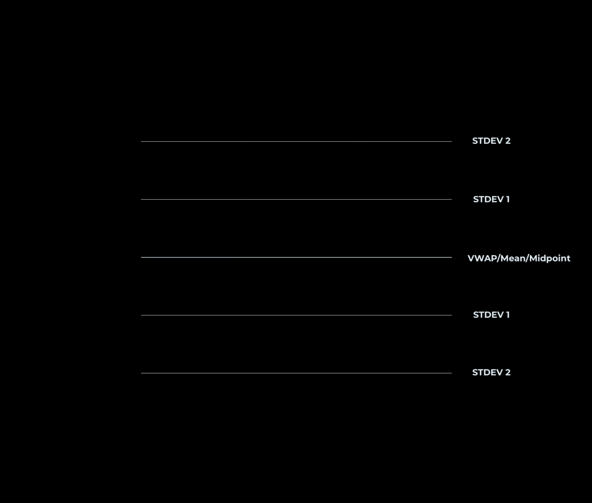

# How To? VWAP

<aside>

$By$ $ARESS$ $and$ $EdgeRunner$

</aside>

Сучасний трейдинг максимально різний: хтось прямує до спрощення, прибирає усі можливі сторонні інструменти та орієнтується лиш на графік; хтось навпаки знаходить деятки складних індикаторів чи чартів, та намагається їх всіх поєднати. Проте правда завжди одна - справжню ціну на ринку рухають ті, хто орієнтується лиш на власний стабільний прибуток, складну математику та глибокий аналіз усіх важливих ринкових показників. Догадуєшся хто це? Правильно - різноманітні інституціонали, дилери, брокери, банки, та інші ключові гравці. 

І тут ми приходимо до розуміння питань, що постають перед ними. Простий приклад: величезний ордер на купівлю мільйона акцій. Одразу зайти за маркетом — означає знищити стакан лімітних заявок на продажу та стрімко підняти ціну, зайти ж за лімітом на весь обʼєм - потенційно розвернути ринок та виконуватись надто довго. Тому справжня битва за ціну точиться не в одному натисканні, а в динаміці, постійному аналізі та грамотному виконанні. Саме тут у гру вступають важливі показники, якими часто нехтують звичайні трейдери, по типу VWAP, а дарма.

---

### **Що таке VWAP і чому він важливий**

Якщо ти спробуєш значно глибше зрозуміти ринок, ніж просто за допомогою свічного чарту, ти прийдеш до наступного визначення: окрім ціни важливу роль відіграє також обʼєм. Ринок може довго торгуватись у певній зоні, проявляти волатильну активність, але насправді вплив таких рухів може виявитись мінімальним на загальне положення гравців ринку. Чому? Відповідь проста - все криється в проторгованих обʼємах та наявній ліквідності. Повноцінний аналіз volume profile або footprints - це окремий напрямок, і часто це відштовхує трейдерів. Тож проблема яка постає перед нами - чи існує простий у використанні інструмент, який би допомагав у одночасному аналізі ціни та обʼєму.

Дякувати вищим силам, і тут подумали за нас. Універсальний та простий інструмент - VWAP (Volume Weighted Average Price) — це середньозважена за обсягом ціна. Хоча такий інструмент і не надає повного аналізу обʼємів, він відображає найважливіше для нас, як трейдерів - реальну середню ціну, за якою насправді відбувалися угоди протягом певного періоду. На відміну від простих ковзних середніх, таких як SMA або EMA, VWAP враховує не лише зміну ціни в часі, а й обсяг торгів, що робить його значно більш точним індикатором реальної активності учасників ринку, дозволяючи визначити ключові діапазони та ціну, що по суті формується на ринку, не в даний момент, а загалом внаслідок торгів.

Різноманітні формації VWAP широко використовуються інституціональними гравцями в аналізі ринку, при чому і при аналізі власних позицій (набираючи десятки та сотні позицій, важливо правильно розрахувати, яка справді в нас середня ціна), оскільки максимально зручно дозволяють зрозуміти, де в середньому позиціюється ринок, яка зона може виступати магнітом для ціни внаслідок попередніх виконаних угод, на які рівні можуть орієнтуватись інші гравці. І головне, все це працює не банально за часом, а за математично чітким показником. Окрім того, у великих організаціях він часто слугує показником ефективності виконання та торгів. Мета використання максимально різна — перша можливість - виконатись якомога ефективніше від VWAP (купити нижче, продати вище), як середнього показника ринку, а тому наша ефективність - виконатись краще за середнє по ринку; дещо інший спосіб - виконатись максимально близько до VWAP, що дозволяє мінімально відхилятись від середнього по ринку, гарантовано зменшити час виконання та здійснювати мінімальний вплив на ринок, а тому ефективність - висока швидкість, потенційно малий slippage та низький рівень впливу на ціну по ринку. Саме тому більшість автоматичних алгоритмів виконання чи торгів, які використовуються банками та хедж-фондами, уважно враховують значення VWAP, як певний орієнтир.

---

### **Як розраховується VWAP**

VWAP розраховується середньою зваженою шляхом ділення суми добутків ціни кожної угоди та її обсягу на сумарний обсяг за певний період. Формула виглядає так:

**Attention**: при обчисленні VWAP на Trading View зазвичай не вираховується справжнє середнє значення на основі кожної угоди, а використовується середнє значення ціни свічки — так звана **typical price**, яка дорівнює (High + Low + Close)/3. Ця typical price множиться на обсяг кожної свічки, далі всі ці значення сумуються наростаючим підсумком і діляться на наростаючий сумарний обсяг. VWAP оновлюється з кожним новим баром, починаючи з першого бару обраного періоду — зазвичай з відкриття торгового дня.

Я рекомендую використовувати VWAP в будь-якій платформі, де є можливість працювати з датою L1/L2 рівня (особисто я використовую Exocharts) — але якщо такої змоги немає, для початку Trading View буде достатньо. І хоча сам принцип побудови VWAP в Trading View дещо порушено, для усвідомлення загальної логіки його використання можна закрити очі на таку неточність, адже там VWAP буде максимально наближений до реального (на відміну від футпрінтів).

---

### **VWAP і алгоритми виконання**

Як ви вже зрозуміли, інституційна торгівля — це зовсім не агресивні імпульси “вдарити ринок”, винести якусь зі сторін чи проманіпулювати ціною. Це ретельне виконання: початковий ордер розбивається на купу частин по 100–500 одиниць (акцій\лотів), і подається стратегічно за певним набором цільових показників та статистичних обмежень. Наприклад, щоб середня ціна виконання алгоритму була близька до VWAP, або щоб позиції алгоритму виконувались не гірше, ніж даний індикатор, тобто не поступались ринку в середньому. Лінія VWAP стає певним орієнтиром виконання, і так ринок “липне” до VWAP — це не випадково, це органічний результат алгоритмічної роботи та постійного аналізу. Але важливо не плутати VWAP як індикатор, та як виконавчий алгоритм, адже виконавчий алгоритм VWAP базується на загальному розподілі обʼємів за певний минулий проміжок часу (тобто потребує значно більше даних та параметрів), в той час як індикатор демонструє лиш середньозважену ціну. Це означає, що VWAP як індикатор може виступати важливим елементом алгоритмів виконання чи звичайних торгових алгоритмів для аналізу ефективності і виставлення обмежень, проте часто потребує додаткових даних для повноцінного конфірму.

---

### **Типи VWAP**

Хоча я вважаю VWAP більше інтрадей індикатором, його подають у декількох варіантах:

- **Сесійний VWAP** — з відкриття сесії до її закриття. Базовий варіант для більшості трейдерів, який в тому числі використовую я.
- **Weekly / Monthly VWAP** — аналогічна логіка, але для ширших часових рамок. Підійде для свінг торгівлі.
- **Anchored VWAP** — дійсно цікавий варіант. Ти сам “якориш” початок: точка старту може бути макро-івент (FOMC), геп, точка початку тренду, або інша ключова для трейдера подія.

---

### Елементи VWAP

Незалежно від типу, кожен VWAP буде складатись з таких елементів, які побудовані на логіці теорії імовірності та математичної статистики:

- VWAP/Mean/Midpoint  — це середньозважена ціна за обсягом, яка показує, де в середньому відбувався найбільший обсяг угод. Тобто ціна, яка найбільш наближена до реальної вартості активу з погляду об’єму.
- **±1σ (перше стандартне відхилення) - п**оказує середній діапазон коливань навколо VWAP. Статистично охоплює приблизно 68% торгової активності. Часто виступає як динамічна зона підтримки/опору. У балансі (флеті) ці межі утримують більшість рухів. А у тренді можуть бути зонами ретесту або підтвердження сили.
- **±2σ (друге стандартне відхилення) - в**изначає розширену межу цінового розкиду. Теоретично охоплює до 95% обсягу торгів за період. Якщо ціна виходить за ±2σ — це ознака: або високої волатильності / імпульсу, або перевищення нормального цінового розподілу, що іноді супроводжується зворотньою реакцією (реверсом ринку).

---

### **Стратегії: VWAP у флеті і тренді**

### VWAP as Support/Resistance level

Щодо самих торгових стратегій — їх не так вже й багато, якщо звести використання до фундаментальної суті. Є реакція на сам VWAP. Якщо ринок вище VWAP, і ціна робить pullback (повернення) — це потенційна точка для входу в лонг. Якщо нижче — в шорт. Це просто, логічно і особливо ефективно в контексті, коли ринок трендовий.

### Flat Phase

У фазі балансу (flat phase) VWAP часто обрамлений смугами стандартного відхилення — STDEV1 / STDEV2 (bands ±1σ / ±2σ). Ось де ефективно може “працювати” mean reversion: верхня границя — шорт, нижня — лонг, тейк — до VWAP. Це проста, але ефективна логіка інтрадей торгів.

### Trend Phase

Коли структура трендова, VWAP стає орієнтиром контролю:

- ціна вище VWAP → сила покупців домінує, pullback до VWAP / STDEV1 — потенційний вхід в лонг;
- нижче VWAP → продавці контролюють ринок, test VWAP / STDEV1 — варіант для шорту.

Також — пробій VWAP + ретест може сигналізувати про початок нового тренду або його підтвердження.

### Flat → Trend Phase

Флетова фаза з часом може змінитись в трендову фазу. Часто це спостерігається протягом дня на американських індексах, де флетова фаза протягом Overnight сесії переходить в трендову фазу з початком RTH. 

### Anchored VWAP

Досить часто можна побачити підходи, які базуються на прив’язці VWAP до конкретної події на ринку або свічки. І це логічно. Якщо ти, наприклад, бачиш новину — умовно «FOMC rate decision» — і ринок після цього вибухає імпульсом, то максимально логічно буде поставити початок обчислення VWAP на цю свічку і далі дивитись: чи ціна лишається вище? Якщо так — покупці контролюють ситуацію. Якщо ціна повертається і падає нижче — інерція згасає, і реверс стає найбільш потенційною реакцією чарту. Такий VWAP використовується як орієнтир: хто контролює ринок після важливої події.

### Naked VWAP

Це VWAP-лінія з минулих сесій, до якої ціна не поверталась після її формування. Іншими словами, це “неперекритий” VWAP — рівень, який так і залишився не протестованим. 

- Якщо входити у позицію за трендом, Naked VWAP із минулого дня чи тижня може бути обґрунтованим тейк-профітом.
- Або ж ринок підходить до Naked VWAP і формується реакція — аргументований тригер для пошуку швидкого реверсу.
- Якщо ціна пробиває його, тоді це сигнал сили в напрямку пробою.

Trading View не дає можливість автоматично “продовжувати” Naked VWAP, але в платформі Exocharts це можливо:

---

### **Чому VWAP — це зона, а не точка**

Значна помилка більшості новачків на ринку - інтерпретація зон чи показників у вигляді чітких ліній та конкретних точок. Проте з досвідом кожен трейдер приходить до розуміння, що ринок - це зони та рівні, а не лінії та точки. Аналогічно VWAP — це не тонка лінія, а зона вагового впливу. Якщо там накопичувався обсяг і звідти почався імпульс — це рівень, за який “більші гравці не хочуть пускати”. Пробій цього рівня з підтвердженням — часто виступатиме сигналом зміни ринкової структури.

### **Приклади тейків і стопів**

- **Тейк:** у флеті — на VWAP або край deviation bands; у тренді — у напрямку руху.
- **Стоп:** не під VWAP буквально — треба ставити за межею, де твоя ідея буде дійсно інвалідована. Наприклад, якщо VWAP пробитий — це чітке анулювання сценарію.

---

## MP + VWAP

Звʼязка Market Profile + VWAP дає дуже хороший вінрейт в комбінації. Ваше завдання надзвичайно просте - знайти ключовий ціновий рівень на MP (це може бути VAH/VAL/POC і тд), який буде пересікатись з VWAP (Midpoint/STDEV) - разом ця область буде виступати хорошою точкою, де ми можемо очікувати потенційну реакцію і формування моделі.

